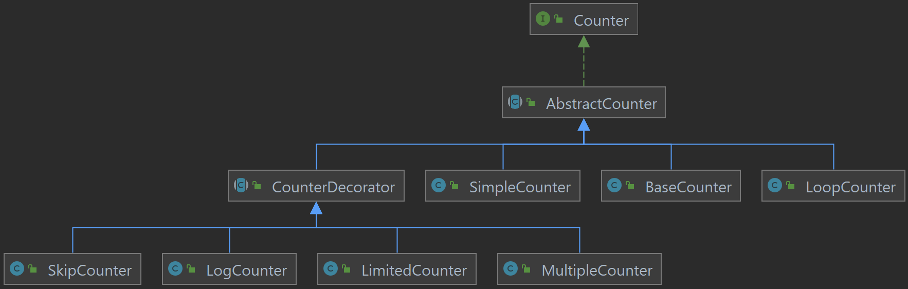

## Decorator

Erstelle Klassen gemäß dem Design Pattern [Decorator](https://refactoring.guru/design-patterns/decorator).
Counter liefern einen `int` Zählerstand retour, wobei wir den beschränkten Wertebereich von `int` ignorieren.

Erstelle dabei Klassen **ähnlich** zu folgendem UML-Diagrams:

* `SimpleCounter`  
Wird mit einem Startstand initialisiert und erhöht den Zähler immer um 1.
* `BaseCounter`  
Startstand 0, im Konstruktor wird eine Basis übergeben (2-10), wobei in diesem Zahlensystem gezählt wird. Eine simple Implementierung läuft über `Integer.toString(int i, int radix)`.
* `LoopCounter`  
Wird mit `int`-Varargs initialisiert und durchläuft nur die übergebenen Zahlen.
* `CounterDecorator`  
Wird mit einem `Counter`  initialisiert.
* `SkipCounter`  
Wird mit einem `int` initialisiert und überspringt so viele Zählerstände des dekorierten Counters.
* `LogCounter`  
Wird mit einem `Path` initialisiert. `tick()`- und `read()`-Aufrufe des dekorierten Counters werden in das File gelogged.
* `LimitedCounter`  
Wird mit einem `int` initialisiert und zählt maximal bis zu diesem Wert hoch.
* `MultipleCounter`  
Wird mit einem `int` initialisiert und liefert beim Hochzählen so oft den Zählerstand des dekorierten Counters.
* Überlege einen eigenen Decorator und teste diesen. Idealerweise [test-driven](https://en.wikipedia.org/wiki/Test-driven_development). 